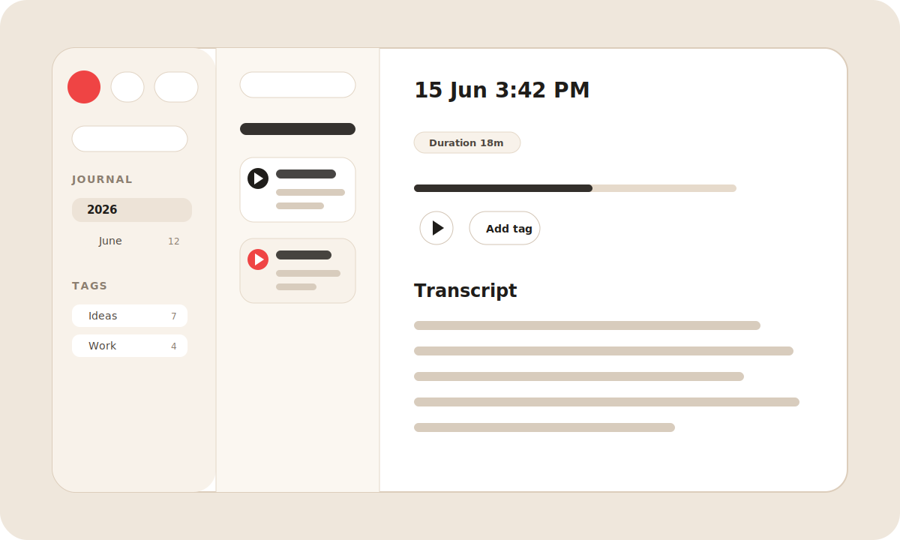

# Journica


Journica is a local-first audio journal for recording spoken notes, transcribing them offline, and finding them later by date, tag, title, or transcript text.

[Download the latest release](https://github.com/Journica/journica-gui/releases) | [Report an issue](https://github.com/Journica/journica-gui/issues)

## Preview



## Why Journica

- Record long voice journals from a desktop app.
- Transcribe recordings locally with Whisper, without sending audio to a cloud service.
- Browse entries by journal date and filter with tags.
- Search titles, filenames, tags, and transcript text.
- Recover in-progress recordings after an app or system crash.
- Play recordings from either the list or transcript view with synced controls.

## Features

| Area | Details |
| --- | --- |
| Recording | Start, pause, resume, and stop audio recordings. |
| Recovery | Active recordings are written in chunks so unexpected shutdowns can be recovered. |
| Transcription | Whisper runs locally and downloads the model on first launch. |
| Organization | Journal sections are grouped by date, and entries can be tagged. |
| Search | Search across entry names, titles, tags, and transcript text. |
| Playback | Shared audio state keeps controls in the list and script panel aligned. |
| Privacy | Audio and transcripts stay on your machine. |

## Downloads

Installers are published from GitHub Releases as draft releases while builds are being verified.

- macOS Apple Silicon: use the `aarch64` macOS build for M1, M2, M3, and M4 Macs.
- macOS Intel: use the `x86_64` macOS build.
- Windows: use the Windows installer from the latest release.
- Linux: use the Linux package from the latest release.

To check your Mac architecture, open Apple menu, then About This Mac. If it says `Chip Apple M...`, use Apple Silicon. If it says `Processor Intel`, use Intel.

## Development

### Requirements

- Node.js 22 or newer
- Rust stable
- Tauri system dependencies for your OS
- SQLite CLI, only needed for manual migration testing

### Install

```bash
npm install
```

### Run The App

```bash
npm run tauri dev
```

### Build

```bash
npm run build
npm run tauri build
```

### Seed Fake Data

Generate artificial recordings and transcripts for local testing:

```bash
npm run seed:data
```

Default seed size is `200` entries.

Useful flags:

```bash
python3 scripts/seed_fake_data.py --count 50
python3 scripts/seed_fake_data.py --append
python3 scripts/seed_fake_data.py --app-dir /path/to/custom/app-data
```

By default this replaces only existing entries with titles starting with `FAKE:` and keeps real recordings untouched.

## Tech Stack

- Tauri 2
- React 19
- TypeScript
- Tailwind CSS 4
- Rust
- SQLite through SQLx
- Whisper through `whisper-rs`

## Project Structure

```text
src/
  features/
    navigation/      Journal tree and navigation UI
    recorder/        Recording session hooks and Tauri API calls
    recordings/      Entry queries, playback, tags, and transcript UI
    transcription/   Model setup and transcription progress hooks
  shared/            Shared UI and utilities
src-tauri/
  migrations/        SQLite schema migrations
  src/features/      Rust recording, transcription, and data commands
```

## Notes

- The transcription model is downloaded on first launch and reused after that.
- Release builds are created by the GitHub Actions `Release` workflow when a `v*` tag is pushed.
- Custom folder membership exists in the data layer but is currently hidden from the UI while tags remain the primary manual organization tool.

## License

No license has been published yet.
