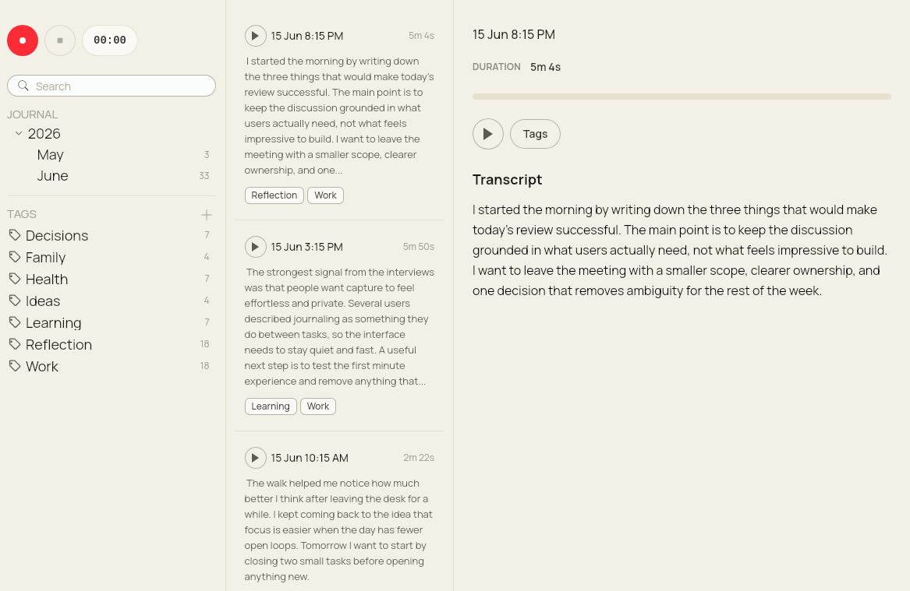

# Journica

Journica is a local-first desktop app for recording spoken notes, transcribing them offline, and finding them later by date, folder, tag, or transcript text.

[Download the latest release](https://github.com/Journica/journica-gui/releases) | [Report an issue](https://github.com/Journica/journica-gui/issues)

## Preview



## Why Journica

- **Stays on your machine.** Audio never leaves your device — recordings are stored locally and transcribed by a bundled Whisper model.
- **Record from your desktop.** Start, pause, and stop journal entries from the app without touching a browser or phone.
- **Find anything fast.** Full-text search across titles, filenames, and transcript text. Filter by date folder or tag.
- **Organize with folders and tags.** Auto-created date folders keep a chronological journal; custom folders and tags let you group entries any way you like.
- **Survives crashes.** In-progress recordings are recovered automatically after an app or system crash.

## Downloads

Installers are available on the [releases page](https://github.com/Journica/journica-gui/releases).

- **macOS Apple Silicon** — use the `aarch64` build (M1/M2/M3/M4)
- **macOS Intel** — use the `x86_64` build
- **Windows** — use the Windows installer
- **Linux** — use the Linux package

To check your Mac chip: Apple menu → About This Mac. `Chip Apple M...` means Apple Silicon; `Processor Intel` means Intel.

## Development

### Requirements

- Node.js 22+
- Rust stable
- Tauri system dependencies for your OS
- SQLite CLI (optional, for manual migration testing)

### Install

```bash
npm install
```

### Run

```bash
npm run tauri dev
```

### Build

```bash
npm run build
npm run tauri build
```

### Seed Fake Data

Generate artificial recordings and transcripts for local testing:

```bash
npm run seed:data
```

Default seed size is 200 entries. Flags:

```bash
python3 scripts/seed_fake_data.py --count 50
python3 scripts/seed_fake_data.py --append
python3 scripts/seed_fake_data.py --app-dir /path/to/custom/app-data
```

By default this replaces only entries with titles starting with `FAKE:` and leaves real recordings untouched.

## Tech Stack

- Tauri 2
- React 19 + TypeScript
- Tailwind CSS 4
- Rust
- SQLite via SQLx
- Whisper via `whisper-rs`

## Project Structure

```text
src/
  features/
    navigation/      Journal tree and navigation UI
    recorder/        Recording session hooks and Tauri commands
    recordings/      Entry queries, playback, tags, folders, and transcript UI
    transcription/   Model setup and transcription progress hooks
  shared/            Shared UI components and utilities
src-tauri/
  migrations/        SQLite schema migrations
  src/features/      Rust commands for recording, transcription, and data
```

## Notes

- The transcription model (~600 MB) is downloaded on first launch and reused after that.
- Release builds are produced by the GitHub Actions `Release` workflow when a `v*` tag is pushed.

## License

This project is released into the public domain under the [Unlicense](LICENSE).
